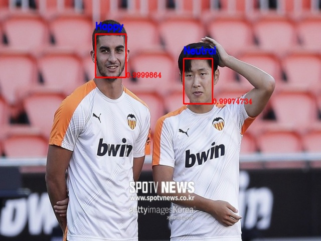

# Face detection & Emotion recognition
------------------------------------------------

## Pre-requisites

* argparse
    > pip install argparse
* Keras
    > pip install keras
* opencv-python
    > pip install opencv-python
* opencv-contrib-python
    > pip install opencv-contrib-python
* Numpy
    > pip install numpy
* facenet-pytorch
    > pip install facenet-pytorch

## Usage

* Clone this repository: $ git clone https://github.com/jaehwan-AI/face_detect

* Run the demo:

  >**image input**
```bash
$ python detect_demo.py --image data/image/image.jpg
```

  >**video input**
```bash
$ python detect_demo.py --video data/video/video.mp4
```

  >**webcam**
```bash
$ python detect_demo.py --src 0
```

## Sample outputs

sample image:



sample video:


